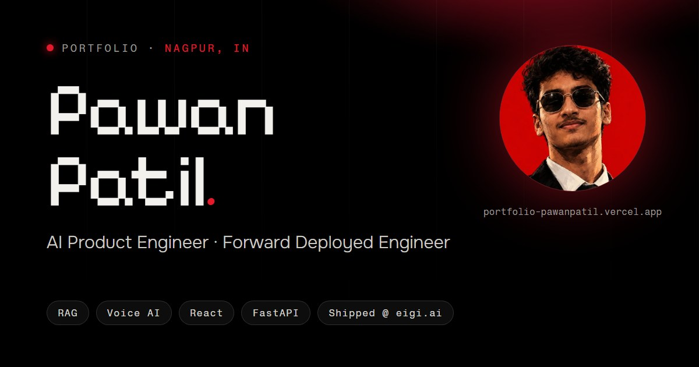

# Pawan Patil — Portfolio

<p>
  <a href="https://portfolio-pawanpatil.vercel.app"></a>
  <a href="https://www.linkedin.com/in/pawanpatil23dec2005"></a>
</p>



The personal portfolio of **Pawan Patil** — AI Product Engineer & Forward Deployed Engineer from Nagpur, India. A dark, pixel-serif, glass-card site that tells a story instead of listing a CV, with a few things you can actually play with.

## Highlights
- **Shipped for eigi.ai** — production work on fde.eigi.ai and the internal admin console
- **Projects** with live demos, GitHub and API links, and screenshot face cards
- **Break my warehouse** — an interactive race showing why atomic inventory reservations prevent overselling
- **Live data** — GitHub contribution calendar, Spotify “on repeat” card with a scratchable vinyl, live Nagpur clock
- **Pixel guestbook** — visitors draw a 16×16 doodle and sign the wall
- **Light / dark** switch with a CRT flip · tech-stack infinite ribbons · résumé download
- **SEO-ready** — Open Graph card, JSON-LD, sitemap, Search Console verified

## Tech stack
| Layer | Stack |
|---|---|
| Frontend | Vanilla HTML, CSS and JavaScript (ES modules), Lenis smooth scroll |
| Backend | Vercel serverless functions (Node.js), Express for local dev |
| Data | MongoDB Atlas (Mongoose) — contact submissions and guestbook |
| Integrations | Nodemailer (Gmail), Spotify Web API + embed, GitHub contributions |

## Project structure
```text
api/            serverless functions: contact, guestbook, spotify
server/         db connection, mailer, validators, Mongoose models
public/         the site: index.html, css/, js/, img/, SEO files
scripts/        spotify-token.js (one-time Spotify refresh token helper)
server.js       local Express server that mirrors the Vercel routes
```

## Run locally
```sh
npm install
cp .env.example .env   # MongoDB, Gmail app password, optional Spotify keys
npm run dev            # http://localhost:3000
```

## Contact
[portfolio-pawanpatil.vercel.app](https://portfolio-pawanpatil.vercel.app) · [GitHub](https://github.com/Pawanp-23) · [LinkedIn](https://www.linkedin.com/in/pawanpatil23dec2005) · pawanpatil2305@gmail.com
